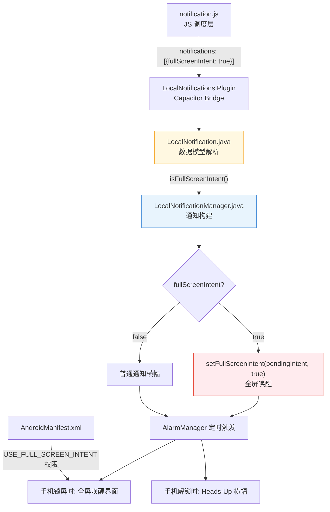

## Product Overview

在现有云课 App 中实现"灵动岛"风格的上课提醒功能。当课程开始前 20 分钟（用户可配置）时，通过 Android 全屏意图通知（FullScreen Intent）弹出醒目的全屏提醒界面，类似来电效果，确保用户不会错过上课时间。

## Core Features

- **全屏意图通知**：使用 Android FullScreenIntent API，上课提醒触发时在锁屏状态下唤醒屏幕显示全屏通知，解锁状态下显示 Heads-Up 横幅
- **高优先级通知渠道**：创建 IMPORTANCE_HIGH 级别的专属通知渠道，确保通知能以横幅形式弹出
- **Android 原生层扩展**：由于 Capacitor LocalNotifications v5 插件不原生支持 fullScreenIntent，需要修改 Android 原生代码（LocalNotification.java + LocalNotificationManager.java）来添加该字段的支持
- **前端调用层适配**：在 notification.js 的通知对象中传入 fullScreenIntent 参数
- **权限声明**：在 AndroidManifest.xml 中声明 USE_FULL_SCREEN_INTENT 权限（Android 10+）
- **设置页面无需变更**：全屏提醒作为所有上课通知的默认行为，不需要额外开关

## Tech Stack

- **前端框架**：Vue 3 (Composition API + `<script setup>`)
- **原生桥接**：Capacitor 5 (`@capacitor/local-notifications` v5.0.8)
- **目标平台**：Android (targetSdkVersion 33, minSdkVersion 22)
- **原生语言**：Java (Android 原生层修改)

## 实现方案：三层架构改造

### 核心问题分析

经过对 Capacitor LocalNotifications v5 插件源码的完整审查：

1. **TypeScript 定义层** (`definitions.d.ts`)：`LocalNotificationSchema` 接口中**没有** `fullScreenIntent` 字段
2. **数据模型层** (`LocalNotification.java`)：Java 类中**没有** `fullScreenIntent` 属性和解析逻辑
3. **通知构建层** (`LocalNotificationManager.java`)：`buildNotification()` 方法中**没有调用** `setFullScreenIntent()`
4. **默认通知渠道** (`createNotificationChannel()`)：使用的是 `IMPORTANCE_DEFAULT`，不够醒目

### 解决策略：Patch 原生插件代码

由于 Capacitor 的 android 目录在 `npx cap sync` 后会被保留为本地代码（不像 iOS 每次同步覆盖），可以直接修改 `android/` 下的插件源码。具体修改 3 个文件 + 1 个权限声明 + 1 个前端文件：

```
修改链路：
notification.js (JS 层传参)
    -> LocalNotification.java (解析 JSON 新增 fullScreenIntent 字段)
    -> LocalNotificationManager.java (构建通知时调用 setFullScreenIntent + 创建高优先级渠道)
    -> AndroidManifest.xml (声明权限)
```

### 关键实现细节

#### 1. AndroidManifest.xml - 添加权限

```xml
<uses-permission android:name="android.permission.USE_FULL_SCREEN_INTENT" />
```

#### 2. LocalNotification.java - 扩展数据模型

- 新增 `boolean fullScreenIntent` 字段
- 在 `buildNotificationFromJSObject()` 中从 JSON 解析：`jsonObject.getBoolean("fullScreenIntent", false)`
- 添加 getter/setter

#### 3. LocalNotificationManager.java - 两处核心改造

**改造 A - 默认通知渠道提升为高优先级**：

```java
// 原来: int importance = android.app.NotificationManager.IMPORTANCE_DEFAULT;
// 改为:
int importance = android.app.NotificationManager.IMPORTANCE_HIGH;
```

IMPORTANCE_HIGH 会发出声音并在屏幕上以横幅形式展示通知。

**改造 B - buildNotification() 中添加 setFullScreenIntent**：

```java
if (localNotification.isFullScreenIntent()) {
    Intent fullScreenIntent = buildIntent(localNotification, DEFAULT_PRESS_ACTION);
    int fsFlags = PendingIntent.FLAG_CANCEL_CURRENT;
    if (Build.VERSION.SDK_INT >= Build.VERSION_CODES.S) {
        fsFlags |= PendingIntent.FLAG_MUTABLE;
    }
    PendingIntent fullScreenPendingIntent = PendingIntent.getActivity(
        context, localNotification.getId(), fullScreenIntent, fsFlags);
    mBuilder.setFullScreenIntent(fullScreenPendingIntent, true);
}
```

关键点：第二个参数 `true` 表示即使用户在使用其他应用，也要全屏展示（类似来电）。

#### 4. notification.js (JS 层) - 通知对象中添加字段

```javascript
notifications.push({
  // ... 现有字段 ...
  fullScreenIntent: true,   // <-- 新增
})
```

## Implementation Notes

- **cap sync 安全性**：修改的是 `android/` 下 capacitor 插件的本地副本（路径类似 `android/capacitor-cordova-android-plugins/capacitor-local-notifications/...`），`npx cap sync` 不会覆盖这些文件。但 `npx cap update` 或重新 add plugin 可能会覆盖，需注意。
- **向后兼容**：`fullScreenIntent` 默认值设为 `false`，不影响非上课通知场景。仅上课提醒传 `true` 即可。
- **Android 10+ 限制**：USE_FULL_SCREEN_INTENT 权限在 Android 10 (API 29) 以上需要显式声明，低版本自动忽略。
- **通知渠道重要性**：将默认渠道改为 IMPORTANCE_HIGH 后，所有通知都会更醒目。如果只想让上课通知高优先级，可创建独立 channel（如 `"course_reminder"`），但这会增加复杂度，建议先统一用高优先级。
- **setPriority 兼容性**：Android 8.0+ 使用 channel importance 控制优先级，但 `setPriority(NotificationCompat.PRIORITY_HIGH)` 对 Android 7.x 及以下仍有效，建议同时设置。

## Architecture Design



## Directory Structure

```
yunke-app/
├── src/
│   └── utils/
│       └── notification.js              # [MODIFY] 通知对象添加 fullScreenIntent: true
├── android/
│   ├── app/src/main/
│   │   ├── AndroidManifest.xml          # [MODIFY] 添加 USE_FULL_SCREEN_INTENT 权限
│   │   └── .../
│   └── .../
├── node_modules/@capacitor/local-notifications/android/src/main/java/com/capacitorjs/plugins/localnotifications/
│   ├── LocalNotification.java            # [MODIFY] 数据模型添加 fullScreenIntent 字段及解析
│   └── LocalNotificationManager.java    # [MODIFY] buildNotification 添加 setFullScreenIntent + 渠道提权
```

注意：实际的 Android 插件源码路径在 sync 后位于 `android/capacitor-cordova-android-plugins/` 子目录下，而非 node_modules 中。node_modules 中的源码作为参考，实际修改的是 android/ 下的副本。

## Agent Extensions

### SubAgent

- **code-explorer**
- Purpose: 在实现过程中定位 android/ 目录下 capacitor-local-notifications 插件的实际文件位置（因为 `npx cap sync` 后的目录结构与 node_modules 不同），并验证修改是否正确应用到正确的文件上
- Expected outcome: 精确定位到需要修改的 Java 文件路径，确认 patch 目标无误